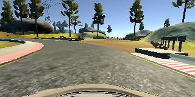
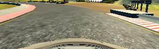
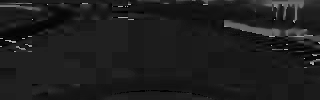
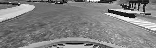
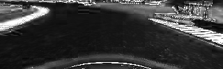

# behaviour_cloning

# Behaviour Cloning Project Submission

## Overview

I created a preprocess_image script and a separated script for learning.

In the following I will explain how the scripts work, and how my algorithm performed.

---

There are **3** python scripts: **preprocess_image.py**, **model.py**, and **drive.py**.

## preprocess.py
This python script imports the raw image data and preprocesses them.

Every single preprocess function is in an own definition. So I can reuse the funtionality for the drive.py part.

I only use the part of the picture, where the streez is ssen. Thats the reason, why I cut the first 50 rows of the picture.

Then I convert the picture to HLS, since I found, that the Result is clearer, because color Change doesn't infleunce my network so hard.

At last, I normalize the picture dividing by 255 and subtracting 0.5

The resulting picture_arrays are saved as **features** and the steering angels as **labels**.

Then, I splitted the data into **train** and **validation**, and saved them as **train_data.pickle** file.

## model.py
In this script the model gets defined and trained. Therefore the saved data from the script above is used.

First, it imports the **pickle** file from the local drive and train the data using model that I built.

The detail of the model can be found in the script.

When the training is done, the model and weights are saved as **model.json** and **model.h5**.

## drive.py
This is the python script that receives the data from the Udacity program, predicts the steering angle using the deep learning model, and send the throttle and the predicted angles back to the program.

For treating the incoming pictures the same way as the model was trained. I need to reuse the preprocess functions from **preprocess_imgage.py**

---

## Preprocessing

The Images get loaded from the local drive and preprocessed by the following functions:


```python
#Cutting the image to the section, that holds the road information
def cut_images_to_arr(img_Center):
    arr_Center = np.array(img_Center)
    arr_Center = arr_Center[60:]
    return arr_Center
```


```python
#Converting the RGB Image to an HLS Image
def convert_to_HLS(img):
    hls = cv2.cvtColor(img, cv2.COLOR_RGB2HLS)
    return hls
```




```python
#Normalizing the input Image
def normalize_image(img):
    max = 255. #np.max(img)
    return (((img) / max) - 0.5)
```


    (1, 18, 80, 1)


    (1, 18, 80, 1)


I had total **18899** items each contained three images from different angles: center, left, and right. So, there are total **18899 x 3 = 56697** images I reshaped and used for training.

---

## Training

____________________________________________________________________________________________________
Layer (type)                     Output Shape          Param #     Connected to
====================================================================================================
convolution2d_1 (Convolution2D)  (None, 20, 64, 10)    760         convolution2d_input_1[0][0]
____________________________________________________________________________________________________
convolution2d_2 (Convolution2D)  (None, 20, 64, 20)    1820        convolution2d_1[0][0]
____________________________________________________________________________________________________
convolution2d_3 (Convolution2D)  (None, 20, 64, 30)    2430        convolution2d_2[0][0]
____________________________________________________________________________________________________
convolution2d_4 (Convolution2D)  (None, 20, 64, 40)    4840        convolution2d_3[0][0]
____________________________________________________________________________________________________
maxpooling2d_1 (MaxPooling2D)    (None, 10, 32, 40)    0           convolution2d_4[0][0]
____________________________________________________________________________________________________
dropout_1 (Dropout)              (None, 10, 32, 40)    0           maxpooling2d_1[0][0]
____________________________________________________________________________________________________
flatten_1 (Flatten)              (None, 12800)         0           dropout_1[0][0]
____________________________________________________________________________________________________
hidden1 (Dense)                  (None, 40)            512040      flatten_1[0][0]
____________________________________________________________________________________________________
activation_1 (Activation)        (None, 40)            0           hidden1[0][0]
____________________________________________________________________________________________________
hidden2 (Dense)                  (None, 20)            820         activation_1[0][0]
____________________________________________________________________________________________________
activation_2 (Activation)        (None, 20)            0           hidden2[0][0]
____________________________________________________________________________________________________
hidden3 (Dense)                  (None, 10)            210         activation_2[0][0]
____________________________________________________________________________________________________
activation_3 (Activation)        (None, 10)            0           hidden3[0][0]
____________________________________________________________________________________________________
dropout_2 (Dropout)              (None, 10)            0           activation_3[0][0]
____________________________________________________________________________________________________
Steering_Angle (Dense)           (None, 1)             11          dropout_2[0][0]
====================================================================================================
Total params: 522931
____________________________________________________________________________________________________
---
# Conclusion

I found that the whole image can confuse the model due to unncessary background noises such as tries, skies, etc. I decided to cut those unncessary pixels and reduced the size by 25%. I only used red channel of the image because I assumed that red channel contains the better information for identifying the road and lanes than green and blue channels. As a result, the size of the image was 18 x 80 x 1.

In my model, I used 4 convolutional layers with 1 max pooling layer, and 3 more dense layers after flatten the matrix. For each convolutional layer, I decreased the channel size by half. When the size of the channel became 2 in the fourth convolutional layer, I applied max pooling with dropout with 25%. After flatten the matrix, the size of features became 360. I used dense layers with 16 features 4 times. Each **epoch** took about **100** seconds and I used **10 epoches** to train the data. As a result, the car drove by itself without popping onto the edges or out of the edges.

The interesting thing I noticed was even though the model allowed the car to drive itself, the accuracy was only about **58%**. So the accuracy did not have to be high for car to drive autonomously. I believe that to increase the accuracy, I would need more data set and more epoches.


```python

```